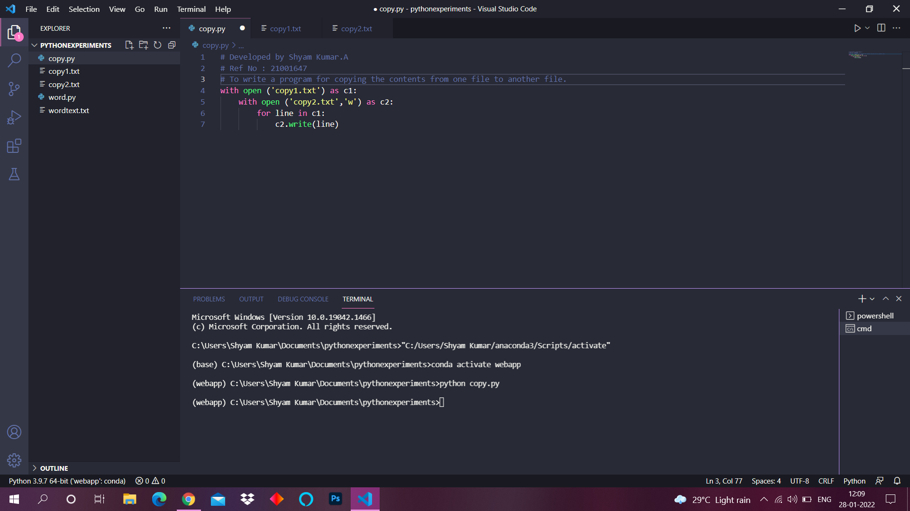
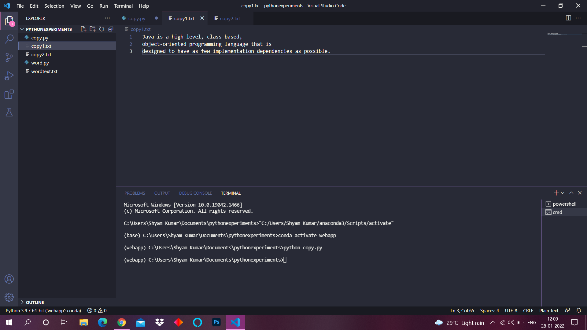
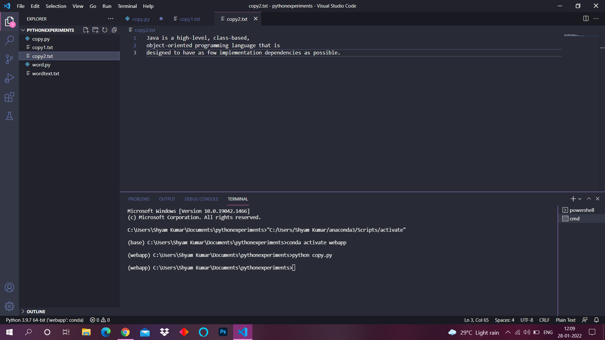

# Copy-file

## AIM:
To write a python program for copying the contents from one file to another file.
## EQUIPEMENT'S REQUIRED: 
PC
Anaconda - Python 3.7
## ALGORITHM: 
### Step 1: Open visual studio code.

### Step 2: Create file with .py extension.

### Step 3: Start the program.

### Step 4: Write the code.

### Step 5: Run terminal for output of the given program.

### Step 6: End the program.

## PROGRAM:
~~~
# Developed by Shyam Kumar.A
# Ref No : 21001647
# To write a program for copying the contents from one file to another file.

with open ('copy1.txt') as c1:
    with open ('copy2.txt','w') as c2:
        for line in c1:
            c2.write(line)
~~~
### OUTPUT:

## RESULT:
Thus the program is written to copy the contents from one file to another file.